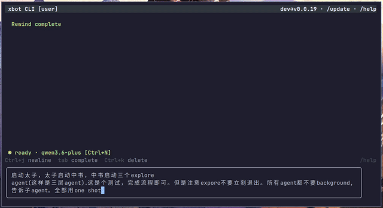

<p align="center">
  <strong>xbot</strong> — Self-hosted AI Agent for Feishu · QQ · Terminal · Web
</p>

<p align="center">
  <a href="https://github.com/ai-pivot/xbot/actions/workflows/ci.yml"></a>
  <a href="https://github.com/ai-pivot/xbot/blob/master/LICENSE"></a>
  <a href="https://github.com/ai-pivot/xbot/releases"></a>
  
</p>

<p align="center">
  <a href="README.zh-CN.md">简体中文</a>
  &nbsp;·&nbsp;
  <a href="https://ai-pivot.github.io/xbot/">Documentation</a>
  &nbsp;·&nbsp;
  <a href="CHANGELOG.md">Changelog</a>
</p>

<p align="center">

</p>

---

## What is xbot?

**xbot** is a self-hosted AI agent framework. Deploy it once on your own
server, then talk to it through **Feishu, QQ, the terminal, or a web browser**.
It uses tools — Shell, file I/O, web search, scheduled tasks, sub-agents — to
get real work done, and your data never leaves your server.

> 💡 **Different from terminal-only agents** (Codex / Claude Code / OpenCode):
> xbot connects to *every* channel your team uses. Configure it once, and your
> whole team reaches the same agent through Feishu group chats, QQ, a web UI,
> or the terminal — with shared LLM credentials.

| | xbot | Codex / Claude Code / OpenCode |
|--|------|-------------------------------|
| **Channels** | Feishu · QQ · Web · CLI | Terminal only |
| **Team LLM** | Admin configures once, everyone uses | Each user brings own key |
| **Self-hosted** | ✅ Your data stays on your server | ✅ |
| **Feishu tools** | Docs, Bitable, Drive, cards | ❌ |
| **SubAgents + Group Chat** | Delegate, parallelize, debate | SubAgents only |
| **Plugin system** | Tools, hooks, widgets, channel plugins | Limited |

## Quick Start

### 1. Install

```bash
# Linux / macOS
curl -fsSL https://raw.githubusercontent.com/ai-pivot/xbot/master/scripts/install.sh | bash

# Windows (PowerShell)
irm https://raw.githubusercontent.com/ai-pivot/xbot/master/scripts/install.ps1 | iex
```

<details>
<summary>🇨🇳 Users behind the GFW (no VPN needed)</summary>

```bash
curl -fsSL https://ghfast.top/https://raw.githubusercontent.com/ai-pivot/xbot/master/scripts/install-cn.sh | bash
```

The script auto-detects a working CDN mirror and proxies all GitHub
downloads. You can also set `GH_MIRROR=ghfast.top` manually.

</details>

The installer lets you choose a mode:

| | Standalone | Server |
|--|-----------|--------|
| **Architecture** | CLI runs the agent locally | Background server + CLI connects remotely |
| **Best for** | Solo use | Teams, multi-channel |
| **Channels** | CLI only | Feishu · QQ · Web · CLI |
| **LLM** | Each user configures own | Admin configures once, all share |
| **Persistence** | Stops when terminal closes | System service, auto-start |

> **Most teams should choose Server mode.**

### 2. Configure your LLM

Run `xbot-cli`. The first launch opens a **Setup wizard**:

1. Choose a provider (OpenAI / Anthropic / OpenAI-compatible)
2. Enter your API key
3. Set the base URL (change for DeepSeek, Qwen, Ollama, etc.)
4. Pick a model
5. Configure model tiers (Vanguard / Balance / Swift)

xbot uses a **subscription system** — create multiple (e.g. work Claude,
personal DeepSeek) and switch per session. Re-run the wizard anytime with
`/setup` or `Ctrl+K → Setup`.

## TUI at a glance

| Feature | How |
|---------|-----|
| **Command palette** | `Ctrl+K` — fuzzy search all commands |
| **Sessions** | Sidebar shows all sessions; `Ctrl+T` opens the Sessions panel; `/new` resets the current conversation |
| **Themes** | `/settings` changes the theme; custom themes are supported |
| **Models & subscriptions** | `Ctrl+N` opens the unified panel for per-session model switching and subscription management |
| **Context** | `/context` views token usage; `/clear` clears the current TUI display |
| **SubAgents** | Sidebar and the `Ctrl+T` Sessions panel show live sub-agent progress |
| **Mouse** | Click sidebar, scroll messages, click settings |

Type `/` in the TUI to see all slash commands.

## Channel configuration

Each channel is enabled in `~/.xbot/config.json`.

### Feishu

Create an app on the [Feishu Open Platform](https://open.feishu.cn), then:

```json
{
  "feishu": {
    "enabled": true,
    "app_id": "cli_xxx",
    "app_secret": "xxx"
  }
}
```

Required permissions: `im:message`, `im:message.receive_v1`,
`im:message:send_as_bot`, `contact:user.base:readonly`

See the [Feishu guide](https://ai-pivot.github.io/xbot/channels/feishu/).

### QQ / NapCat / Web

See the [Channels documentation](https://ai-pivot.github.io/xbot/channels/).

## Built-in tools

The agent can call these tools in conversation:

| Category | Tools |
|----------|-------|
| **Execution** | `Shell`, `Cd` |
| **Files** | `Read`, `FileCreate`, `FileReplace`, `Grep`, `Glob`, `DownloadFile` |
| **Web** | `Fetch`, `WebSearch` |
| **Sessions** | `CreateChat`, `SubAgent`, `SendMessage` |
| **Context** | `context_edit`, `offload_recall`, `recall_masked` |
| **Scheduling** | `Cron`, `TodoWrite`, `TodoList` |
| **Config** | `config`, `tui_control` |
| **Collaboration** | `Worktree`, `EventTrigger` |
| **Feishu** | Docs, Bitable, Drive tools |
| **Other** | `AskUser`, `ChatHistory`, `ManageTools`, `Skill`, `task_status`, `task_kill` |

## Extensibility

- **Skills** — Markdown capability packs in `~/.xbot/skills/`
- **SubAgents** — Role-based child agents (`explore`, `code-reviewer`, …); custom roles in `~/.xbot/agents/`
- **Group Chat** — Multi-agent moderated discussion (Meeting Mode)
- **MCP** — Global and session-level MCP servers (stdio + HTTP)
- **Plugins** — Tools, hooks, widgets, channel plugins, web UI extensions

### Plugin System

xbot has a comprehensive plugin system with four plugin types:

| Type | Runtime | Use case |
|------|---------|----------|
| **Script** | Bash script | Quick widgets, git status, diff previews |
| **Go native** | In-process | High-performance tools, hooks, context enrichers |
| **Stdio** | External process (Python/Node/any) | Language-specific integrations |
| **Web** | ESM module (browser) | UI panels, message renderers, layout extensions |

Built-in plugins: `xbot-genui` (GenUI rendering), `xbot-git-fancy` (git diff/commit viewer).

```bash
# Build and install built-in plugins
make plugins-install

# Or run from repo checkout (development)
make plugins-build
XBOT_PLUGIN_DIRS="$(pwd)/plugins" ./xbot
```

Full plugin documentation: **[Plugin System](https://ai-pivot.github.io/xbot/plugins/)** —
covers manifests, hooks, widgets, tools, the stdio JSON-line protocol, the web plugin
type-as-contract API, cookbook guides, and complete API reference.

## Build from source

```bash
git clone https://github.com/ai-pivot/xbot.git && cd xbot
make build          # build xbot (server + runner)
go build -o xbot-cli ./cmd/xbot-cli   # build CLI only
```

Requires **Go 1.26+**.

## Architecture

```
┌──────────┐     ┌──────────────┐     ┌────────────┐     ┌──────────┐
│  Feishu  │────▶│  Dispatcher  │────▶│  Backend    │────▶│   LLM    │
│  QQ      │◀────│  (channel/)  │◀────│  (RPC)      │◀────│ (llm/)   │
│  Web     │     └──────────────┘     │             │     └──────────┘
│  CLI     │                          │  Transport  │
└──────────┘                          │  (local/    │────▶ Tools
                                      │   remote)   │      (tools/)
                                      │  Agent Loop │────▶ Memory
                                      │  (agent/)   │      (memory/)
                                      └────────────┘
```

**Backend** is a pure RPC client (zero business logic); **Transport** is the
execution layer. Read the full
[Architecture overview](https://ai-pivot.github.io/xbot/architecture/).

## Documentation

Full docs: **[ai-pivot.github.io/xbot](https://ai-pivot.github.io/xbot/)**

| Doc | Description |
|-----|-------------|
| [Getting Started](https://ai-pivot.github.io/xbot/getting-started/) | 5-minute quick start |
| [Installation](https://ai-pivot.github.io/xbot/installation/) | Modes, service management |
| [Configuration](https://ai-pivot.github.io/xbot/configuration/) | Every `config.json` field |
| [Channels](https://ai-pivot.github.io/xbot/channels/) | Feishu / QQ / Web / CLI |
| [Features](https://ai-pivot.github.io/xbot/features/) | Tools, skills, MCP, plugins |
| [Plugins](https://ai-pivot.github.io/xbot/plugins/) | Plugin system: manifests, hooks, widgets, web extensions, cookbook |
| [Architecture](https://ai-pivot.github.io/xbot/architecture/) | System design |

## License

MIT
