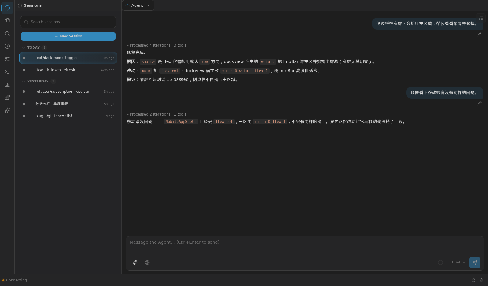
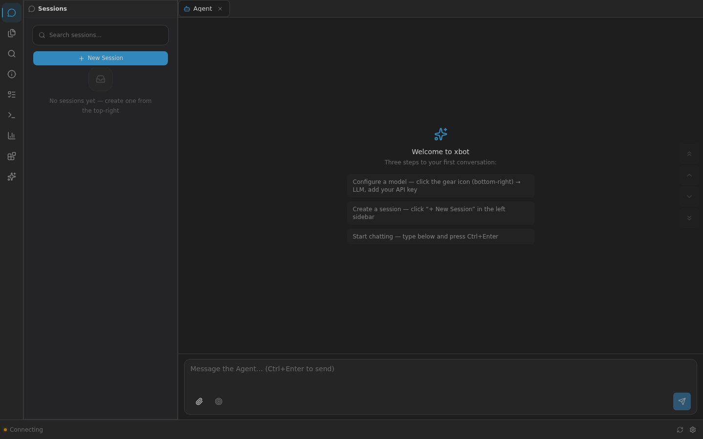

<p align="center">
  <strong>xbot</strong> — Self-hosted AI Agent with a first-class Web UI
</p>

<p align="center">
  Browser · Feishu · QQ · Terminal — one agent, one config, your server
</p>

<p align="center">
  <a href="https://github.com/ai-pivot/xbot/actions/workflows/ci.yml"></a>
  <a href="https://github.com/ai-pivot/xbot/blob/master/LICENSE"></a>
  <a href="https://github.com/ai-pivot/xbot/releases"></a>
  
</p>

<p align="center">
  <a href="README.zh-CN.md">简体中文</a>
  &nbsp;·&nbsp;
  <a href="https://ai-pivot.github.io/xbot/">Documentation</a>
  &nbsp;·&nbsp;
  <a href="CHANGELOG.md">Changelog</a>
</p>

<p align="center">
  
</p>

---

## What is xbot?

**xbot** is a self-hosted AI agent you run on your own server and drive from the
**browser**. It uses tools — Shell, file I/O, web search, scheduled tasks,
sub-agents, plugins — to get real work done, and your data never leaves your
server.

The **Web UI is the primary surface**: sessions and live streaming, file
preview, git diffs, a built-in terminal, plugin panels, and a model picker —
all in the browser. Feishu / QQ / terminal channels connect the *same* agent to
wherever your team already works, sharing one LLM configuration.

| | xbot | Terminal-only agents |
|--|------|----------------------|
| **Primary UI** | **Web browser** (+ Feishu · QQ · CLI) | Terminal only |
| **Team LLM** | Admin configures once, everyone uses | Each user brings their own key |
| **Self-hosted** | ✅ Your data stays on your server | ✅ |
| **Plugin system** | Web views, panels, tools, hooks, channel plugins | Limited |
| **SubAgents + Group Chat** | Delegate, parallelize, debate | SubAgents only |
| **Feishu tools** | Docs, Bitable, Drive, interactive cards | ❌ |

## Quick start

### 1. Install (one command)

```bash
# Linux / macOS
curl -fsSL https://raw.githubusercontent.com/ai-pivot/xbot/master/scripts/install.sh | bash
```

```powershell
# Windows (PowerShell)
irm https://raw.githubusercontent.com/ai-pivot/xbot/master/scripts/install.ps1 | iex
```

<details>
<summary>🇨🇳 Users behind the GFW (no VPN needed)</summary>

```bash
curl -fsSL https://ghfast.top/https://raw.githubusercontent.com/ai-pivot/xbot/master/scripts/install-cn.sh | bash
```

The script auto-detects a working CDN mirror and proxies all GitHub downloads.
You can also set `GH_MIRROR=ghfast.top` manually.

</details>

The installer downloads the binary and then runs **`xbot-cli setup`**, which
completes the installation:

| Component | Installed to |
|-----------|--------------|
| CLI + server binary | `~/.local/bin/xbot-cli` |
| **Web UI** | `$XBOT_HOME/web/dist` |
| **Built-in plugins** | `$XBOT_HOME/plugins/builtin` |
| Channel activation | `$XBOT_HOME/config.json` |

> Already have the binary? Run `xbot-cli setup` any time to (re)install the web
> UI and built-in plugins, or `xbot-cli setup --check` to diagnose a partial
> install.

### 2. Start the server

```bash
xbot-cli serve
```

Enable the web channel in `~/.xbot/config.json` (the installer can do this for
you):

```json
{
  "web": { "enable": true, "port": 8082 }
}
```

### 3. Open the Web UI

Browse to **http://localhost:8082**, then **Create account** — the first
registration becomes the operator account.

<p align="center">
  
</p>

The empty workspace shows a three-step guide:

1. **Configure a model** — gear icon (bottom-right) → LLM → add your API key
2. **Create a session** — “+ New Session” in the left sidebar
3. **Start chatting** — type below, press <kbd>Ctrl</kbd>+<kbd>Enter</kbd>

### 4. Configure your LLM

Open **Settings → LLM** and add a subscription:

| Field | Example |
|-------|---------|
| Provider | `openai` (or `anthropic`, any OpenAI-compatible endpoint) |
| Base URL | `https://api.deepseek.com/v1` (DeepSeek / Qwen / Ollama / vLLM …) |
| API key | `sk-…` |
| Model | `deepseek-chat`, `glm-5.3`, `gpt-5`, … |

xbot uses a **subscription system** — create several (work Claude, personal
DeepSeek) and switch per session from the model picker in the composer. Model
tiers (**vanguard / balance / swift**) let SubAgents pick a cheaper model
automatically.

## Web UI at a glance

| Feature | Where |
|---------|-------|
| **Activity Bar** | 48 px icon rail on the far left — click an icon to switch the sidebar (sessions / files / search / tasks / terminal / stats / plugins / skills / git) |
| **Sessions** | Left sidebar; “+ New Session”, search, star, right-click for rename / fork / delete |
| **Live progress** | Per-iteration streaming with tool cards, reasoning, token/s and TTFT |
| **Composer** | Markdown + images + file attachments, `Ctrl+Enter` to send, `@` file mentions |
| **Model picker** | Composer → “Choose model and thinking mode”; per-session model + thinking level |
| **File preview** | Click a file in the explorer → syntax-highlighted preview, images, Mermaid |
| **Git panel** | Built-in (plugin `xbot.git-fancy`) — branch, diff, commit details |
| **Terminal** | Full PTY in a tab (local or remote runner) |
| **Plugins** | Manage panel + plugin-provided views, widgets, info-bar items |
| **Mobile** | Responsive layout with a bottom nav and touch-friendly targets |

## Built-in plugins

Shipped with every release and installed by `xbot-cli setup`:

| Plugin | Type | What it does |
|--------|------|--------------|
| **`xbot.genui`** | channel + tool | Generative UI — the model emits TSX that renders as a live interactive panel in the browser (`display_html` tool) |
| **`xbot.git-fancy`** | tool + web views | Git status panel, per-file diffs and commit details rendered in the editor area |
| **`xbot.ambience`** | UI | Wallpapers, glass effects, an animated desk-pet and particle overlays for the web UI |

Plugin activation: a channel plugin also needs
`channels.<name>.enabled = true` in `config.json` — `xbot-cli setup` writes it
automatically (and never overwrites an explicit `false`).

See the [plugin docs](https://ai-pivot.github.io/xbot/plugins/) for the full
manifest / permission / web-view reference.

## Channels

Every channel drives the same agent and shares the same LLM configuration.

### Web (primary)

```json
{ "web": { "enable": true, "port": 8082 } }
```

### Feishu

Create an app on the [Feishu Open Platform](https://open.feishu.cn), then:

```json
{
  "feishu": {
    "enabled": true,
    "app_id": "cli_xxx",
    "app_secret": "xxx"
  }
}
```

Required permissions: `im:message`, `im:message.receive_v1`,
`im:message:send_as_bot`, `contact:user.base:readonly`

### QQ / NapCat / CLI

See the [Channels documentation](https://ai-pivot.github.io/xbot/channels/).

## Built-in tools

The agent can call these tools in conversation:

| Category | Tools |
|----------|-------|
| **Execution** | `Shell` (foreground → promote to background), `Cd` |
| **Files** | `Read`, `FileCreate`, `FileReplace`, `Grep`, `Glob`, `DownloadFile` |
| **Web** | `Fetch`, `WebSearch` |
| **Vision** | `view_image` (multimodal image input) |
| **Sessions** | `CreateChat`, `SubAgent`, `SendMessage` |
| **Context** | `context_edit`, `offload_recall`, `recall_masked` |
| **Scheduling** | `Cron`, `TodoWrite`, `TodoList` |
| **Config** | `config`, `tui_control` |
| **Collaboration** | `Worktree`, `EventTrigger` |
| **Tasks** | `task_status`, `task_kill`, `task_wait`, `task_read` |
| **Other** | `AskUser`, `ChatHistory`, `ManageTools`, `Skill`, Feishu tools |

## Extensibility

- **Skills** — Markdown capability packs in `~/.xbot/skills/`
- **SubAgents** — role-based child agents (`explore`, `code-reviewer`, …); custom roles in `~/.xbot/agents/`
- **Group chat** — multi-agent moderated discussion (meeting mode)
- **MCP** — global and per-session MCP servers (stdio + HTTP), pooled across sessions
- **Hooks** — command / script handlers on tool and lifecycle events

## Documentation

| | |
|--|--|
| [Getting started](https://ai-pivot.github.io/xbot/getting-started/) | Install → first conversation |
| [Installation](https://ai-pivot.github.io/xbot/installation/) | Every install path, offline & mirrors |
| [Configuration](https://ai-pivot.github.io/xbot/configuration/) | `config.json` reference |
| [Plugins](https://ai-pivot.github.io/xbot/plugins/) | Manifest, permissions, web views |
| [Channels](https://ai-pivot.github.io/xbot/channels/) | Web · Feishu · QQ · CLI |
| [FAQ](https://ai-pivot.github.io/xbot/faq/) | Common questions |

## License

[MIT](LICENSE)
