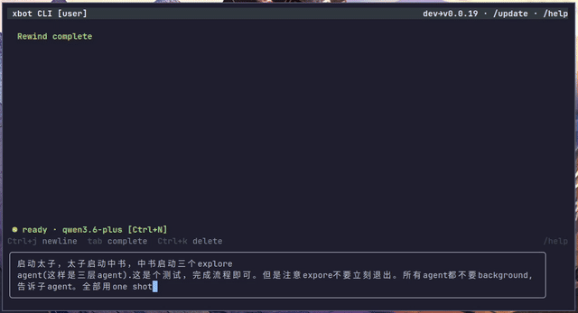

<p align="center">
  <strong>xbot</strong> — 自托管 AI Agent，接入你的飞书 / QQ / 终端 / 浏览器
</p>

<p align="center">
  <a href="https://github.com/ai-pivot/xbot/actions/workflows/ci.yml"></a>
  <a href="https://github.com/ai-pivot/xbot/blob/master/LICENSE"></a>
  <a href="https://github.com/ai-pivot/xbot/releases"></a>
  
</p>

<p align="center">
  <a href="README.md">English</a>
  &nbsp;·&nbsp;
  <a href="https://cjiw.github.io/xbot/zh-cn/">文档</a>
  &nbsp;·&nbsp;
  <a href="CHANGELOG.md">更新日志</a>
</p>

<p align="center">

</p>

---

## xbot 是什么？

**xbot** 是一个自托管 AI Agent 框架。部署一次在你自己的服务器上，通过
**飞书、QQ、终端、浏览器**与它对话。它能调用工具——Shell、文件读写、网页搜索、
定时任务、子 Agent——完成实际工作，数据不出你的服务器。

> 💡 **与终端专用 Agent 不同**（Codex / Claude Code / OpenCode）：xbot 接入团队
> 使用的**每一个渠道**。配置一次，全团队就能通过飞书群、QQ、网页或终端与同一个
> Agent 对话，共享 LLM 凭据。

| | xbot | Codex / Claude Code / OpenCode |
|--|------|-------------------------------|
| **渠道** | 飞书 · QQ · Web · CLI | 仅终端 |
| **团队 LLM** | 管理员配一次，所有人用 | 各自配置 API Key |
| **自托管** | ✅ 数据不出服务器 | ✅ |
| **飞书工具** | 文档、多维表格、云盘、卡片 | ❌ |
| **子 Agent + 群聊** | 委派、并行、辩论 | 仅子 Agent |
| **插件系统** | 工具、hooks、widget、渠道插件 | 有限 |

## 快速开始

### 1. 安装

```bash
# Linux / macOS
curl -fsSL https://raw.githubusercontent.com/ai-pivot/xbot/master/scripts/install.sh | bash

# Windows (PowerShell)
irm https://raw.githubusercontent.com/ai-pivot/xbot/master/scripts/install.ps1 | iex
```

<details>
<summary>🇨🇳 国内用户（无需翻墙）</summary>

```bash
curl -fsSL https://ghfast.top/https://raw.githubusercontent.com/ai-pivot/xbot/master/scripts/install-cn.sh | bash
```

脚本自动检测可用的 CDN 镜像并代理所有 GitHub 下载。也可手动设置
`GH_MIRROR=ghfast.top`。

</details>

安装器会让你选择模式：

| | Standalone（单机） | Server（服务端） |
|--|-----------|--------|
| **架构** | CLI 直接运行 Agent | 后台 Server + CLI 远程连接 |
| **适合** | 个人使用 | 团队、多渠道 |
| **渠道** | 仅 CLI | 飞书 · QQ · Web · CLI |
| **LLM** | 各自配置 | 管理员配一次，全团队共享 |
| **持久化** | 关终端就停 | 系统服务，开机自启 |

> **大多数团队应选 Server 模式。**

### 2. 配置 LLM

运行 `xbot-cli`，首次启动会弹出 **Setup 向导**：

1. 选择提供商（OpenAI / Anthropic / 兼容 API）
2. 输入 API Key
3. 配置 API 地址（DeepSeek、Qwen、Ollama 等需修改）
4. 选择模型
5. 配置模型层（Vanguard / Balance / Swift）

xbot 使用**订阅系统**——可创建多个（如工作用 Claude、个人用 DeepSeek），按会话切换。
随时用 `/setup` 或 `Ctrl+K → Setup` 重新配置。

## TUI 功能速览

| 功能 | 操作 |
|------|------|
| **命令面板** | `Ctrl+K` 模糊搜索所有命令 |
| **会话管理** | 侧边栏显示所有会话；`/new` 新建 |
| **主题** | `Ctrl+K → Theme` 或 `/palette theme`；支持自定义 |
| **模型切换** | `Ctrl+N` 循环模型，`Ctrl+P` 切换订阅 |
| **上下文** | `/context` 查看 token 用量，`/clear` 清空 |
| **子 Agent** | 侧边栏查看实时进度（`Ctrl+T`） |
| **鼠标** | 点击侧边栏、滚动消息、点击设置 |

在 TUI 中输入 `/` 查看所有 slash 命令。

## 渠道配置

每个渠道在 `~/.xbot/config.json` 中启用。

### 飞书

在 [飞书开放平台](https://open.feishu.cn) 创建应用后：

```json
{
  "feishu": {
    "enabled": true,
    "app_id": "cli_xxx",
    "app_secret": "xxx"
  }
}
```

最小权限：`im:message`、`im:message.receive_v1`、`im:message:send_as_bot`、
`contact:user.base:readonly`

详见[飞书配置指南](https://cjiw.github.io/xbot/zh-cn/channels/feishu/)。

### QQ / NapCat / Web

详见[渠道文档](https://cjiw.github.io/xbot/zh-cn/channels/)。

## 从源码构建

```bash
git clone https://github.com/ai-pivot/xbot.git && cd xbot
make build          # 构建 xbot (server + runner)
go build -o xbot-cli ./cmd/xbot-cli   # 仅构建 CLI
```

需要 **Go 1.26+**。

## 文档

完整文档：**[cjiw.github.io/xbot/zh-cn](https://cjiw.github.io/xbot/zh-cn/)**

## License

MIT
